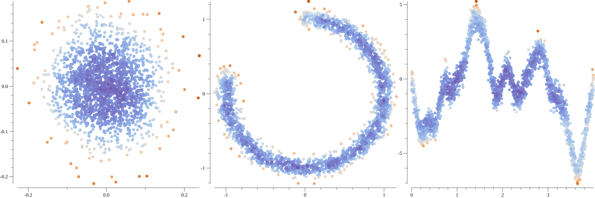

[](https://pkg.go.dev/github.com/oskanberg/eif-go)

## Extended Isolation Forest

This is a simple Go implementation for the Extended Isolation Forest described in [this paper](https://doi.org/10.1109/TKDE.2019.2947676). It is used for detecting anomalies and outliers in multidimensional data. Extended Isolation Forest in turn is an improvement on the Isolation Forest described in [this paper](https://doi.org/10.1109/ICDM.2008.17).

This library currently only supports `float64` type (of any dimension).



The authors of the Extended Isolation Forest have created [a Python version of the algorithm](https://github.com/sahandha/eif).

## Usage

```
go get -u github.com/oskanberg/eif-go
```

Please refer to the [godoc reference](https://pkg.go.dev/badge/github.com/oskanberg/eif-go).

In this basic example, a forest is built from a set of random normally distributed 3D points:

```go
data := make([][]float64, 100)
for i := range data {
    data[i] = []float64{rand.NormFloat64(), rand.NormFloat64(), rand.NormFloat64()}
}

f := eif.NewForest(data, eif.WithMaxTreeDepth(12), eif.WithTrees(100))
fmt.Println(f.Score([]float64{0.0, 0.0, 0.0}))       // 0.37800519781971176
fmt.Println(f.Score([]float64{1.0, 1.0, 1.0}))       // 0.4581319136519572
fmt.Println(f.Score([]float64{100.0, 100.0, 100.0})) // 0.6520795100807051
```

Note that `eif.WithMaxTreeDepth(12), eif.WithTrees(100)` are optional parameters.